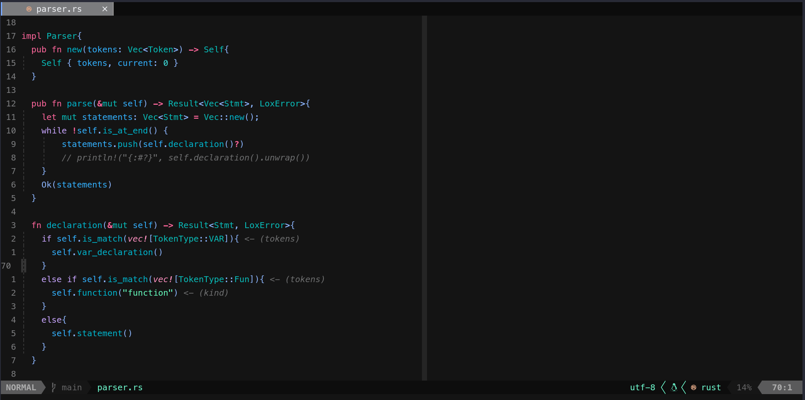

# Neovim Config

## Plugin Manager -> Packer

## Plugins: 

- telescope
- lsp-zero
- nvim-tree
- nvim-autopairs
- nvim-treesitter
- lualine
- indent-blackline
- rust-tools
- barbar

## Screenshot: 

